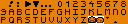

## Procedural Island Generator

Generates an overworld map with [DFS](https://en.wikipedia.org/wiki/Depth-first_search). This results in a map, where every tile is reachable from every other tile.

### Credits

 is an extended version of [Blowhard 2: Blow Harder][bh2] by [surt][] and therefore licensed under [cc0][]

 is a reduced version of [SQUONT8NG][bh2] by [basxto][] and therefore licensed under [cc0][]

 is from [Zoria Tileset][zoria] by [DragonDePlatino][] and licensed under [CC-BY 4.0][by4] (Not used in the ROM)

 is inspired by zoria and compatible with blowhard, but an original creation of [basxto][] and licensed under [cc0][]

All code is licensed under [MIT][].

[bh2]: https://opengameart.org/content/blowhard-2-blow-harder
[surt]: https://opengameart.org/users/surt
[zoria]: https://opengameart.org/content/zoria-tileset
[DragonDePlatino]: https://opengameart.org/users/dragondeplatino
[SQUONT8NG]: https://opengameart.org/content/squont8ng
[basxto]: https://opengameart.org/users/ba%C5%9Dto
[cc0]: http://creativecommons.org/publicdomain/zero/1.0/
[by4]: https://creativecommons.org/licenses/by/4.0/
[MIT]: license.md